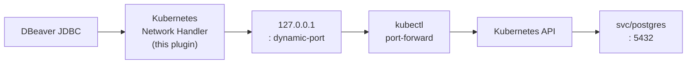

# dbeaver-k8s-port-forward

Kubernetes Port Forward for DBeaver Community



> [!IMPORTANT]
> Third-party extension for DBeaver Community.\
> Not affiliated with or endorsed by DBeaver Corp.

- [Requirements](#requirements)
- [Installation](#installation)
  - [Always-latest (no download)](#always-latest-no-download)
  - [From a GitHub release (no build required)](#from-a-github-release-no-build-required)
  - [Build from source](#build-from-source)
  - [Alternative: scripted install](#alternative-scripted-install-via-dbeavers-own-p2-director)
- [Configuration](#configuration)
- [Architecture](#architecture)
- [Lifecycle](#lifecycle)
- [Security](#security)
- [Troubleshooting](#troubleshooting)
- [Build](#build)
- [Compatibility](#compatibility)
- [License](#license)

When you connect a DBeaver connection with the Kubernetes handler enabled:

1. the plugin starts `kubectl port-forward` for the resource/port you configured;
2. it waits until kubectl reports the tunnel is actually ready (never a fixed `sleep`);
3. it discovers the local port kubectl picked;
4. DBeaver then connects its JDBC driver to `127.0.0.1:<that port>` instead of the original host.

When the connection is closed (or fails), the corresponding `kubectl` process is terminated and
no state is left behind. Every connection gets its own independent tunnel and local port, so
multiple simultaneous connections (e.g. dev/stage/prod) never interfere with each other.

Kubernetes authentication is entirely delegated to `kubectl`/your kubeconfig — this plugin never
implements its own auth, so anything your `kubectl` already supports (EKS, GKE, AKS, OpenShift,
`exec` credential plugins, OIDC, cloud CLIs, ...) keeps working unmodified.

## Requirements

- DBeaver Community Edition (built/tested against the `devel` branch at commit `fc2a972a`,
  product version `26.2.2` — see "Compatibility" below).
- A `kubectl` binary reachable by DBeaver (on `PATH`, or an absolute path configured in the
  handler).
- A working kubeconfig with network access to the target Kubernetes API server.
- RBAC permission to `get` the target resource and to `create` on its `portforward` subresource
  in the target namespace (e.g. `pods/portforward` or the equivalent for the resource kind you
  target).

## Installation

### Always-latest (no download)

The p2 site is also hosted live at
`https://nikvoronin.github.io/dbeaver-k8s-port-forward/`, rebuilt automatically by
[`.github/workflows/publish-pages.yml`](./.github/workflows/publish-pages.yml) every time a
release is published. Instead of downloading and extracting the zip, add that URL directly:
Help → Install New Software... → Add... → this time paste the URL instead of browsing to a
Local... folder → select "DBeaver Kubernetes Extensions" → Next → Finish → restart DBeaver.
This site always reflects the latest published release (it is overwritten on every publish, not
versioned), so it's best for staying current rather than pinning to a specific release.

### From a GitHub release (no build required)

Published releases are at
[github.com/nikvoronin/dbeaver-k8s-port-forward/releases](https://github.com/nikvoronin/dbeaver-k8s-port-forward/releases).
Each release carries a `p2-repository-<tag>.zip` asset — the same p2 site described below,
pre-built by CI (see `.github/workflows/release.yml`), so no JDK/Maven is needed to install it.

1. Download `p2-repository-<tag>.zip` from the release,
2. and extract it somewhere
   (e.g. `C:\dbeaver-k8s-port-forward-repo\`).
3. In DBeaver:
   - Help
   - Install New Software...
   - Add...
   - Local...
   - select the extracted folder
   - select "DBeaver Kubernetes Extensions"
   - Next
   - Finish
   - restart DBeaver

**To update to a newer release:** download and extract the new release's zip (over the old
folder, or a fresh one), then in DBeaver use **Help → Check for Updates** rather than reopening
"Install New Software" — the latter is for a first install, not for picking up a newer version of
something already installed. If DBeaver still doesn't offer the new version (p2 caches a local
repository's metadata by its folder path), remove the old site entry first — **Window →
Preferences → Install/Update → Available Software Sites**, select the entry, **Remove** — then
add it again via **Add... → Local...** pointing at the (re-)extracted folder. As a last resort,
one restart with `-clean -consoleLog` clears any remaining stale p2/OSGi cache — see
[docs/troubleshooting.md](./docs/troubleshooting.md)'s "Diagnosing extension-registry / OSGi resolution problems" section.

### Build from source

If you'd rather build it yourself (e.g. to test an unreleased change), `.\mvnw.cmd clean verify`
produces the same kind of local p2 repository at `repository/target/repository/` (`content.jar`,
`artifacts.jar`, `plugins/*.jar`), grouped under one category, **"DBeaver Kubernetes
Extensions"**. Install it through DBeaver's own **Help → Install New Software...** wizard the same
way as above.

The same `repository/target/repository` folder can later be hosted over plain HTTP (this
project's own such site is the always-latest URL mentioned above; or any static file server for
your own build) and added in the wizard as a `https://...` URL instead of a local folder — no
server-side logic is needed, it's a static file tree.

### Alternative: scripted install via DBeaver's own p2 director

[scripts/Install-DBeaverPlugin.ps1](./scripts/Install-DBeaverPlugin.ps1) remains useful for a fully scripted install/update loop
(e.g. while iterating on the plugin), since it also builds the plugin and does not require going
through the wizard by hand each time. It runs the p2 tooling that ships inside DBeaver's own
installation headlessly, via its console launcher:

```powershell
# Close DBeaver first -- the script refuses to run while it's open.
.\scripts\Install-DBeaverPlugin.ps1 -DBeaverHome C:\path\to\DBeaver
```

This builds the plugin (`mvnw.cmd clean verify`), generates a throwaway local p2 repository from
the two built jars using DBeaver's own bundled p2 publisher, then installs them into that DBeaver
installation using DBeaver's own bundled p2 director. Running the exact same command again after
making code changes **updates** the installed plugin (it always uninstalls whatever's already
there first, since this project's version string doesn't change between builds, then installs the
freshly built jars) — so this one script covers first install and every subsequent update.

Other useful flags:

```powershell
# Reinstall whatever's already built, without rebuilding:
.\scripts\Install-DBeaverPlugin.ps1 -DBeaverHome C:\path\to\DBeaver -SkipBuild

# Remove the plugin entirely:
.\scripts\Install-DBeaverPlugin.ps1 -DBeaverHome C:\path\to\DBeaver -Uninstall
```

Once it succeeds, start DBeaver — "Kubernetes" should appear as a network handler on any
connection's settings, alongside "SSH" and "Proxy", with a populated settings panel. See the
script's own comment-based help (`Get-Help .\scripts\Install-DBeaverPlugin.ps1 -Full`) for the
exact `dbeaverc.exe -application ...` commands it runs, if you want to replicate or adapt them
(e.g. for Linux/macOS, via the `-Os`/`-Ws`/`-Arch` parameters and that platform's own `dbeaverc`
launcher — untested by this project, which targets Windows).

## Configuration

On a connection's "Kubernetes" tab:

```text
kubectl executable: kubectl
kubeconfig:         (blank = kubectl's own default resolution)
context:            dev-cluster
namespace:          backend
resource:           svc/postgres
remote port:        5432
local port:         Automatic
bind address:       127.0.0.1
startup timeout:    15
```

Tick the tab's own checkbox to enable the handler (DBeaver draws that on the tab itself, not
inside this plugin's panel).

### PostgreSQL example

```text
Database:               postgres
Username:               postgres
Original database host: postgres
Original database port: 5432

Kubernetes:
  context:     kind-test
  namespace:   dbeaver-test
  resource:    svc/postgres
  remote port: 5432
  local port:  Automatic
```

See [docs/integration-test.md](./docs/integration-test.md) for the full end-to-end manual test procedure, including
Kubernetes manifests for a disposable PostgreSQL workload.

## Architecture

```text
DBeaver
  |
  | connect()
  ↓
KubernetesTunnelHandler (DBWTunnel)
  |
  | start
  ↓
KubectlPortForwardTunnel
  |
  | ProcessBuilder (argument list, never a shell string)
  ↓
kubectl port-forward
  |
  | stdout: "Forwarding from 127.0.0.1:49173 -> 5432"
  ↓
KubernetesTunnelHandler
  |
  | DBWUtils.updateConfigWithTunnelInfo(..., "127.0.0.1", 49173)
  ↓
JDBC connects to 127.0.0.1:49173
```

Full class-by-class breakdown, sequence diagrams for connect/disconnect, threading model and
process-ownership rules: [docs/architecture.md](./docs/architecture.md). Reference notes on the exact DBeaver extension
points/classes this plugin relies on (traced against the DBeaver Community source):
[docs/dbeaver-api-notes.md](./docs/dbeaver-api-notes.md).

## Lifecycle

- **Startup**: `kubectl port-forward` is launched fresh for every connect attempt (including
  every "Test Connection" click — DBeaver creates a new handler instance each time). The plugin
  blocks until kubectl's own "Forwarding from ..." readiness line appears, kubectl exits, or the
  configured startup timeout elapses — never a fixed `sleep`.
- **Shutdown**: on disconnect (or a failed connect), the plugin asks kubectl to terminate
  gracefully, waits briefly, then forcibly kills it (and any child processes) if it didn't exit.
  This is idempotent — closing twice, or closing a tunnel that never fully started, never throws.
- **Mid-connection kubectl exit** (e.g. the backing pod was replaced): detected on the next
  DBeaver validation/ping cycle and surfaced as an actionable error; the plugin does not
  automatically reconnect in v1 (see [docs/architecture.md](./docs/architecture.md)).

## Security

- The forwarded port defaults to binding **127.0.0.1 only** — never `0.0.0.0`. If you explicitly
  configure a non-loopback bind address, the forwarded database port becomes reachable by other
  hosts on whatever network can reach that address; only do this if you specifically need it.
- All configuration values are passed to `kubectl` as a `ProcessBuilder` argument list — never
  concatenated into or interpreted by a shell (`sh -c`, `cmd.exe /c`, `powershell -Command`, ...),
  so there is no shell-injection path through any field (kubeconfig path, context, namespace,
  resource, ...).
- Kubernetes authentication is entirely delegated to `kubectl`/kubeconfig; this plugin never
  implements or stores its own Kubernetes credentials.
- Diagnostic logging never includes PostgreSQL passwords, kubeconfig credential contents, bearer
  tokens, private keys, or the full process environment.

## Troubleshooting

See [docs/troubleshooting.md](./docs/troubleshooting.md) for a symptom → cause → diagnostic command → fix table covering
authentication failures, RBAC/authorization failures, resource-not-found errors, port-forward
failures, and how to tell those apart from a downstream PostgreSQL/JDBC problem. Quick commands:

```bash
kubectl config current-context
kubectl config get-contexts
kubectl get namespace
kubectl -n <namespace> get svc
kubectl -n <namespace> get pods
kubectl -n <namespace> port-forward svc/postgres :5432
```

## Build

Requires only a JDK (21+) — Maven itself is not required to be installed; the checked-in Maven
Wrapper downloads it on first use.

```powershell
.\mvnw.cmd clean verify
```

This runs the full build: downloads the handful of `org.jkiss.dbeaver.*` bundles this plugin
compiles against from DBeaver's own public p2 update site (`buildtools/dbeaver-deps`), compiles
both plugin bundles, runs all unit tests (against a fake `kubectl` — no real cluster needed),
packages both OSGi bundle jars, and generates the p2 install repository (see "Installation"
above). See [docs/dbeaver-api-notes.md](./docs/dbeaver-api-notes.md) section 7 for why this is a plain Maven build rather than
Tycho.

Artifacts after a successful build:

```text
plugins/io.github.nikvoronin.dbeaver.k8s/target/io.github.nikvoronin.dbeaver.k8s_<version>.jar
plugins/io.github.nikvoronin.dbeaver.k8s.ui/target/io.github.nikvoronin.dbeaver.k8s.ui_<version>.jar
repository/target/repository/{content.jar,artifacts.jar,plugins/*.jar}
```

## Compatibility

Built and compiled against DBeaver Community's `devel` branch, commit `fc2a972a8d79c017ff505d42135ce6b39f8719b3`
(product version `26.2.2.qualifier`, `Bundle-RequiredExecutionEnvironment: JavaSE-21`) — the
current state of the public `dbeaver.io` p2 update site as of the date this was built. The
DBeaver APIs this plugin uses (`DBWNetworkHandler`, `DBWTunnel`, `DBWForwarder`,
`DBWHandlerConfiguration`, `IObjectPropertyConfigurator`) are the same public extension points
DBeaver's own built-in SSH and SOCKS proxy handlers use — see [docs/dbeaver-api-notes.md](./docs/dbeaver-api-notes.md) section 8 for the specific compatibility/versioning risks and which packages would need re-review after a DBeaver upgrade.

**Manually verified** installed and running inside a real DBeaver `26.2.1.202609210342` desktop
install (Windows, self-updated from a `26.1.0` base install) via the p2 director method above:
the "Kubernetes" tab renders with a populated settings panel, saved settings round-trip
correctly, and attempting to connect actually launches real `kubectl port-forward`, whose
real-cluster error output (`Error from server (NotFound): ...`) is surfaced verbatim in DBeaver's
own error log through this plugin's `PortForwardException` — confirming the full
handler → `ProcessBuilder` → kubectl → DBeaver error-reporting path works end-to-end, not just in
the unit tests. A full successful *connection* (tunnel ready, JDBC connected) was not observed in
this manual check — see [docs/integration-test.md](./docs/integration-test.md) for the documented procedure to complete that
with a real, reachable Kubernetes Service.

## License

Apache License 2.0 — see [LICENSE](./LICENSE). This plugin was developed by reading DBeaver Community
Edition's source (also Apache-2.0) to trace its network-handler extension points; no DBeaver PRO
code was used or copied at any point (see [docs/dbeaver-api-notes.md](./docs/dbeaver-api-notes.md)).
