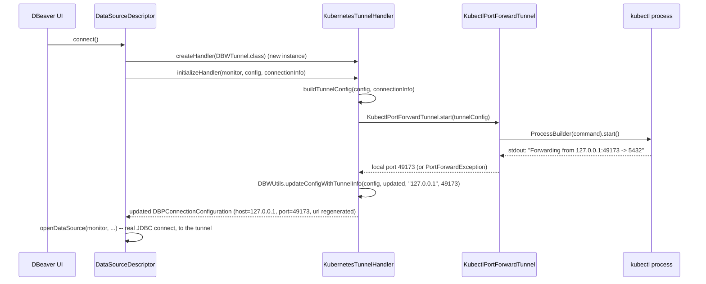
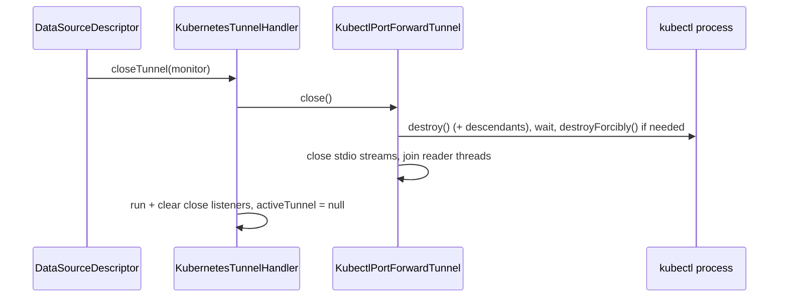

# Architecture

## Major classes

```text
plugins/io.github.nikvoronin.dbeaver.k8s/            (core bundle — no SWT/JFace dependency)
  tunnel/
    KubernetesTunnelConfig       Immutable, validated tunnel configuration (builder pattern)
    KubectlCommandBuilder        Builds `kubectl port-forward` argument lists (never a shell string)
    KubectlPortForwardTunnel     Owns one kubectl process: start/await-ready/close, diagnostics
    PortForwardOutputParser      Parses "Forwarding from ..." lines to discover the local port
    PortForwardException         Actionable failure with recent kubectl output attached
    DiagnosticBuffer             Bounded ring buffer of recent stdout/stderr lines
  handler/
    KubernetesTunnelHandler      DBWTunnel implementation; the only class DBeaver talks to
    KubernetesTunnelConstants    DBWHandlerConfiguration property keys, shared with the UI module
  kubeconfig/
    KubeconfigReader             Resolves/parses a kubeconfig's contexts+namespaces (UI suggestions only)
    KubeconfigSummary            Immutable result: context names and per-context namespaces

plugins/io.github.nikvoronin.dbeaver.k8s.ui/         (UI bundle — SWT only)
  ui/
    KubernetesTunnelConfiguratorUI   IObjectPropertyConfigurator<Object, DBWHandlerConfiguration>
```

The split exists so the tunnel engine (`tunnel` package) is usable and unit-testable with zero
Eclipse/SWT dependency, and so a DBeaver build without desktop UI plugins loaded still only needs
the core bundle to make the handler itself function (the UI bundle is only needed to *configure*
it interactively).

## Sequence: connect



If `KubectlPortForwardTunnel.start()` throws, `initializeHandler()` never returns a
configuration, `DataSourceDescriptor.connect()`'s catch block runs `closeTunnelHandler()` and
rethrows — `openDataSource()` (the actual JDBC connect) is never reached. There is no code path
that falls back to the original, untunnelled host/port.

## Sequence: disconnect



`closeTunnel()` and `KubectlPortForwardTunnel.close()` are both idempotent: calling either twice,
or calling `close()` on a tunnel whose `start()` already failed, is a no-op the second time and
never throws.

## Process ownership

- One `KubectlPortForwardTunnel` = one OS process = one `KubernetesTunnelHandler` instance =
  one DBeaver connect attempt. DBeaver creates a fresh handler instance per connect (including
  every "Test Connection" click), so there is no pooling/reuse to reason about and no shared
  mutable state between connections — three simultaneous connections (dev/stage/prod) each get
  their own process, their own local port and their own lifecycle; closing one has no effect on
  the others (see `KubectlPortForwardTunnelTest.multipleConcurrentTunnelsGetIndependentPortsAndLifecycles`).
- No static registry of running tunnels exists anywhere in this plugin.

## Threading model

- `initializeHandler()` blocks the calling thread (whatever thread DBeaver's connect lifecycle
  runs on) for at most `startupTimeout` (default 15s) — there is no unbounded wait. DBeaver's own
  `DataSourceDescriptor.connect()` already runs off the SWT UI thread for real connects; "Test
  Connection" and similar synchronous callers are bounded by the same timeout.
- Each `KubectlPortForwardTunnel` owns exactly two daemon threads (`kubectl-stdout-N`,
  `kubectl-stderr-N`) that continuously drain the process's stdout/stderr into a bounded
  `DiagnosticBuffer` (200 lines) so the OS pipe buffer can never fill up and stall kubectl. Being
  daemon threads, they can never prevent JVM/DBeaver shutdown even in a bug scenario; `close()`
  additionally joins them (bounded, 2s) for clean shutdown in the common case.
- The UI's "Test kubectl" button runs `kubectl version --client` on a throwaway daemon thread and
  marshals the result back via `UIUtils.asyncExec(...)`, never blocking the SWT thread.

## Error propagation

`PortForwardException` (checked) carries the failure message, the last up-to-200 lines of kubectl
output, and the exit code if known. `KubernetesTunnelHandler.initializeHandler()` wraps it as a
`DBException` with `PortForwardException.getDetailedMessage()` (headline + recent output) as the
message, which is what DBeaver surfaces to the user in its connection error dialog. No exception
is ever swallowed; process-cleanup failures are logged (`Log`) but don't mask the original error.

## Local-port discovery

The local port is never chosen by this plugin. `KubectlCommandBuilder` always asks kubectl for
the port itself (`:REMOTE_PORT` when "Local port" is "Automatic"; `LOCAL:REMOTE_PORT` when the
user pins one), and `PortForwardOutputParser` extracts the port kubectl actually bound from its
"Forwarding from ..." stdout line. This avoids the classic race — pick a free port, close the
probe socket, another process grabs it before kubectl starts — that a "find a free port ourselves"
approach would be exposed to.

## DBeaver API integration boundary

Everything under `handler/` is the only code that touches DBeaver/Eclipse types
(`DBWTunnel`, `DBWHandlerConfiguration`, `DBRProgressMonitor`, `DBWUtils`, ...); everything under
`tunnel/` is plain Java (`java.lang.Process`, `java.util.regex`, `java.time.Duration`) with no
DBeaver/Eclipse dependency at all, and is exercised directly by unit tests without any Eclipse
runtime. See `docs/dbeaver-api-notes.md` for the full trace of the DBeaver-side API surface
this boundary relies on, and section 8 there for compatibility risk.

## Not implemented in v1 (by design)

- **Automatic reconnection.** `invalidateHandler()` only detects that the kubectl process has
  died (via `isRunning()`) and raises an actionable `DBException` — DBeaver's own reconnect flow
  (creating a fresh handler instance and calling `initializeHandler()` again) is what actually
  re-establishes the tunnel. Automatic reconnection/recovery is intentionally out of scope; this
  keeps the state machine trivial to reason about (a tunnel is either up or it is not).
- **Optional post-readiness TCP probe.** An extra "connect a raw socket to confirm readiness"
  check after kubectl's own "Forwarding from" line was considered and left out. kubectl only
  prints that line once its local listener is already bound and accepting, so the probe would be
  redundant in the success case and only adds Windows-firewall/timing flakiness risk in the
  failure case; kubectl's own "Forwarding from" line remains the single readiness signal.
- **`DBWForwarder.matchesParameters`** always returns `false` — see `docs/dbeaver-api-notes.md`
  section 8 for why the SSH/SOCKS host:port-matching heuristic doesn't apply to a
  `(context, namespace, resource, port)`-addressed tunnel.
